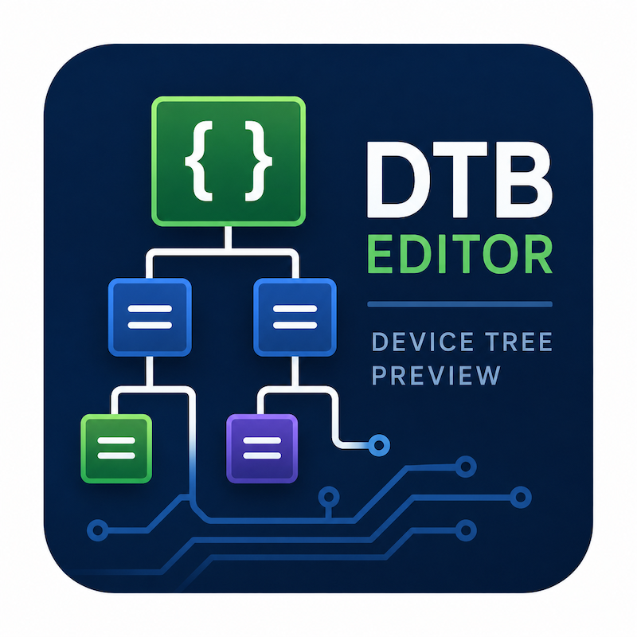
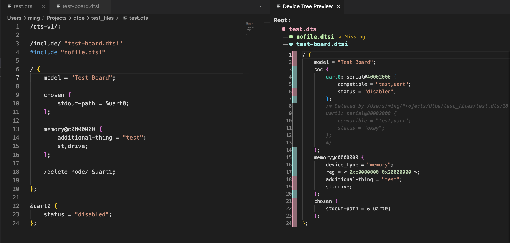

# Device Tree Editor



Device Tree Editor is a Visual Studio Code extension for inspecting Linux Device Tree source trees. It builds a merged preview from a root `.dts` or `.dtsi` file, tracks where each rendered line came from, and makes large include hierarchies easier to follow.

## Features

- Preview a merged Device Tree from the active `.dts` or `.dtsi` file.
- Resolve `#include` and `/include/` directives.
- Show a clickable include hierarchy at the top of the preview.
- Preserve per-file colour coding with a compact source gutter.
- Open included files directly from the file key.
- Highlight the currently active editor file in the file key.
- Merge repeated root blocks and child nodes.
- Apply label-reference overlays such as `&uart0 { ... };`.
- Preserve and mark deleted nodes/properties from `/delete-node/` and `/delete-property/`.
- Keep missing Device Tree includes visible in the file key without injecting warning comments into the rendered DTS.
- Render the preview including syntax highlighting and search.



## Usage

1. Open a `.dts` or `.dtsi` file.
2. Run **Device Tree Editor: Preview DTS** from the Command Palette.
3. The Device Tree Preview opens beside the editor.
4. Use the file key at the top of the preview to inspect the include hierarchy.
5. Click a filename in the file key to open that file.

From the preview title bar, use **Use Active Editor as Root** to rebuild the preview using the currently active editor file.

## Preview Behaviour

The preview shows the final merged tree rather than the raw source file. It preserves useful source context without cluttering the DTS output:

- The first gutter column is a colour strip, not a repeated filename column.
- The file key shows which file each colour represents.
- The file key is nested so parent/child include relationships are visible.
- Missing `.dts`, `.dtsi`, and `.dtso` includes are marked with `Missing` in the file key.
- Missing non-DTS includes, such as C header-style binding files, do not produce preview warning comments.

## Supported DTS Patterns

### Includes

```dts
#include "soc.dtsi"
/include/ "pins.dtsi"
```

### Root Merges

```dts
/ {
    model = "example";
};

/ {
    compatible = "vendor,board";
};
```

### Label References

```dts
&uart0 {
    status = "okay";
};
```

### Delete Directives

```dts
/delete-property/ status;
/delete-node/ old_node;
```

Deleted content is shown as commented, muted DTS so you can still see what was removed and where the delete directive came from.

## Known Limitations

- The parser focuses on practical preview and merge behaviour, not full Device Tree schema validation.
- The extension does not invoke `dtc`.
- The preview is read-only.
- Some advanced DTS/preprocessor constructs may not be represented exactly.

## License

MIT. See [LICENSE](LICENSE).
